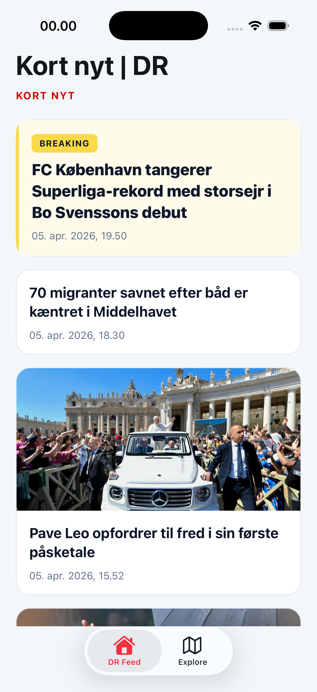
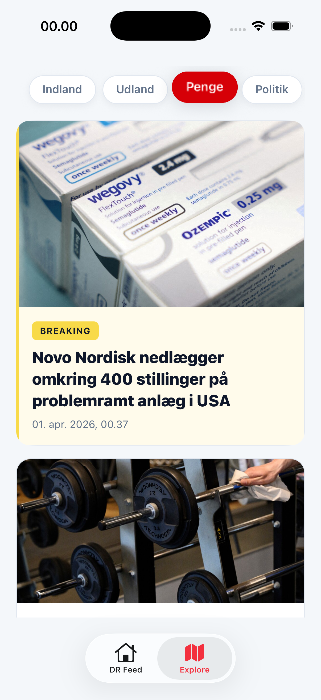
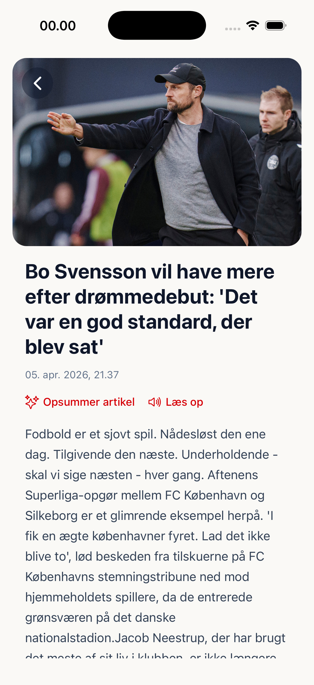
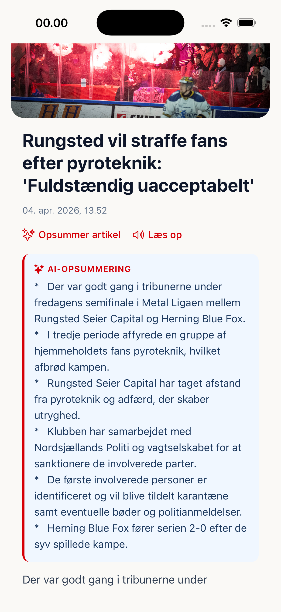

# DR nyhedsapp

Projektet er bygget med React Native og Expo 55 i managed flow.

Appen bruger expo-router med filbaseret navigation.

## Indhold

- [Kernefunktionalitet](#kernefunktionalitet)
  - [Derudover er der implementeret](#derudover-er-der-implementeret)
- [Sådan startes appen](#sådan-startes-appen)
- [API'er](#apier)
  - [Artikelsiden bruger GraphQL](#artikelsiden-bruger-graphql)
  - [LLM](#llm)
- [Overvejelser / tradeoffs](#overvejelser-tradeoffs)
- [Demo](#demo)

## Kernefunktionalitet

- Henter og viser en liste af nyheder med titel og billede
- Hver teaser er klikbar og navigerer til en artikelside
- Artikelsiden henter yderligere artikeldata via DR's GraphQL API
- Oplæsning af artikel via expo-speech
- Brug af open source og lokal LLM til at lave en opsummering af en artikel
- In-app browser: Artikelsiden har en "Læs på DR.dk"-knap nederst der åbner artiklen i en in-app browser via expo-web-browser

### Derudover er der implementeret

- Pull-to-refresh – træk ned for at genindlæse feedet
- Lille animation på kategorivælger i explore-siden
- Skeleton loading i feedet

## Sådan startes appen

For at køre appen skal man have Node.js på sin maskine og [Expo Go](https://expo.dev/go)-appen på en telefon (eller en iOS/Android-simulator).

Sæt `EXPO_PUBLIC_DR_STEFFI_GRAPHQL_URL` i din `.env`-fil.

```bash
npm install
npm start
```

Scan QR-koden med Expo Go (Android) eller Kamera-appen (iOS). Alternativt kan appen køres i simulator/emulator.

## API'er

Appen bruger DR's RSS-feeds:  
https://www.dr.dk/service/dr-nyheder-som-rss-feed-1

I hjemmeskærmen bruges _Seneste nyt_:  
https://www.dr.dk/nyheder/service/feeds/senestenyt

I explore-skærmen bruges følgende:

- Indland: https://www.dr.dk/nyheder/service/feeds/indland
- Udland: https://www.dr.dk/nyheder/service/feeds/udland
- Penge: https://www.dr.dk/nyheder/service/feeds/penge
- Politik: https://www.dr.dk/nyheder/service/feeds/politik
- Sporten: https://www.dr.dk/nyheder/service/feeds/sporten
- Seneste sport: https://www.dr.dk/nyheder/service/feeds/senestesport
- Viden: https://www.dr.dk/nyheder/service/feeds/viden
- Kultur: https://www.dr.dk/nyheder/service/feeds/kultur
- Musik: https://www.dr.dk/nyheder/service/feeds/musik
- Vejret: https://www.dr.dk/nyheder/service/feeds/vejret

### Artikelsiden bruger GraphQL

På artikelsiden hentes artiklens indhold via URN-id fra DR's GraphQL API.

`src/hooks/useArticleByUrn.ts`

### LLM

Jeg har prøvet at eksperimentere med, om man kan integrere en LLM i appen. Jeg har lavet et lille forsøg med opsummering af en artikel.

Jeg har lavet en lille REST API med Express:  
https://github.com/YousefMohsen/DR-llm

Servicen snakker med en lokal LLM, der tager imod artikelteksten og laver en opsummering som bullet points.

Der ligger en vejledning til opsætning af servicen her:  
https://github.com/YousefMohsen/DR-llm/blob/main/README.md

## Overvejelser / tradeoffs

**Theming og farver**  
Farver og spacing er i øjeblikket hardcoded direkte i de enkelte komponenter. Hvis jeg skulle bygge videre på appen, ville jeg centralisere det i en theme-fil.

**Base komponenter**  
Jeg vil lave base-komponenter som `Text`, `Button`, `Link` osv., så designet er konsistent på tværs af appen.

**Tabbar navigation**  
Tabbaren i `app/(tabs)/_layout.tsx` er fra Expo 55 eksempelprojektet. Den er ikke helt klar til produktion endnu og bruger `"expo-router/unstable-native-tabs"`.  
Jeg ville ikke bruge den i en produktionsapp.

**Platform**  
Jeg har primært udviklet og optimeret til iOS.

## Demo

Skærmbilleder og en kort demo-video af appen (filerne ligger i mappen [`demo/`](demo/)).

### Hjem / feed



### Udforsk



### Artikel



### Opsummering



<video src="demo/demo.mp4" controls playsinline width="100%">
  <a href="demo/demo.mp4">Åbn demo-videoen (MP4)</a>
</video>

Hvis videoen ikke vises i din visning, kan du åbne filen direkte: [demo/demo.mp4](demo/demo.mp4).
